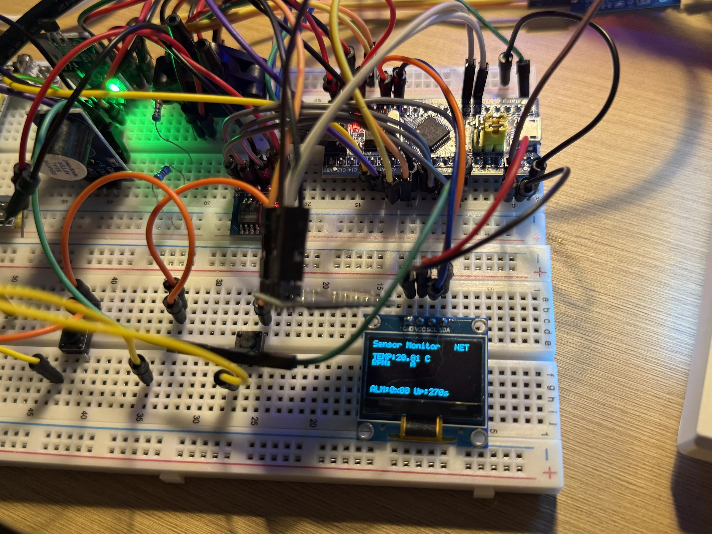

# STM32 多传感器数据采集系统

[](https://github.com/rongyishuaige7/stm32-multisensor-data-acquisition/actions/workflows/firmware.yml)
[](LICENSE)

一个以 STM32F103C8T6 为核心的教学型数据采集原型：采集温度、压力、转速和光电状态，将记录写入 W25Q64，通过 ESP-01S 的 AT 固件在可信局域网内发送 TCP JSON，并在离线或发送失败时使用环形缓存等待补传。

> **项目状态（2026-07-17）：** 当前公开候选的源码已确认，PlatformIO 固件构建和 Python 工具语法检查已通过；**尚未对当前提交做真机复测**。本仓库暂时没有实物照片、演示视频、EDA/原理图或 PCB 文件。详情见 [项目状态](docs/PROJECT_STATUS.md) 和 [验证记录](docs/VERIFICATION.md)。

## 历史素材证据（2026-07-18 发布）

已脱敏的历史照片。日期、脱敏处理、未公开材料和证据边界见 [MEDIA_EVIDENCE](docs/MEDIA_EVIDENCE.md)。



历史照片、截图或 EDA 不证明当前公开提交已烧录或完成真机复测。**当前未进行真机复测。**


## 系统闭环

```text
DS18B20 ─┐
FSR402  ─┼─→ STM32F103C8T6 ─→ W25Q64 历史/离线记录
A1104  ──┤          │
E3Z-LS63 ┘          ├─→ SSD1306 OLED / 蜂鸣器
                    │
                    └─ USART1 → ESP-01S（AT 固件）
                                      │
                                      └─ TCP JSON → Python 客户端 / Web 网关
```

这是一张结构示意，不是 PCB 原理图，也不表示当前硬件在线。

## 主要能力

- 四类输入：DS18B20 温度、FSR402 压力原型映射、A1104 霍尔转速、E3Z-LS63 光电状态；
- W25Q64：
  - 约定 4 KB 离线环形区；
  - 从 `0x100000` 开始的历史记录区；
  - 每条记录 12 字节；
- ESP-01S 使用官方/出厂 AT 固件，无需单独开发 ESP 固件；
- TCP 多连接 JSON 广播、历史查询和离线补传；
- SSD1306 本地显示、蜂鸣器阈值报警和手动按键；
- Python 标准库 TCP 客户端和 `aiohttp` WebSocket 网关。

## 目录

| 路径 | 内容 |
|---|---|
| [`firmware/`](firmware/) | PlatformIO + STM32Cube HAL 固件 |
| [`tools/tcp_client.py`](tools/tcp_client.py) | 命令行 TCP 客户端，仅用 Python 标准库 |
| [`tools/web/`](tools/web/) | TCP 到 WebSocket 的轻量 Web 网关 |
| [`hardware/BOM.csv`](hardware/BOM.csv) | 从源码推导并标记待实物确认的 BOM |
| [`hardware/wiring-diagram.svg`](hardware/wiring-diagram.svg) | 接线边界图，不是 PCB 原理图 |
| [`HARDWARE.md`](HARDWARE.md) | 引脚、电源、电压域和接线注意事项 |
| [`docs/PROTOCOL.md`](docs/PROTOCOL.md) | TCP JSON 协议 |
| [`docs/PROJECT_STATUS.md`](docs/PROJECT_STATUS.md) | 证据分层和已知限制 |
| [`docs/VERIFICATION.md`](docs/VERIFICATION.md) | 可复现构建与真机复测清单 |

## 硬件与引脚

当前文档按可构建源码中的定义编写：

| 功能 | STM32 引脚 | 说明 |
|---|---|---|
| DS18B20 | PB12 | 1-Wire；源码/既有文档要求 4.7 kΩ 上拉 |
| FSR402 | PA1 | ADC1_IN1；输出是未校准的原型映射值 |
| A1104 | PA0 | EXTI0 上升沿计数 |
| E3Z-LS63 | PA4 | 数字输入；实际电平接口必须按传感器铭牌核对 |
| 蜂鸣器 | PB0 | 源码按低电平有效处理 |
| 静音按键 | PB5 | 低有效，内部上拉 |
| W25Q64 | PA5/PA6/PA7 + PB1 CS | SPI1 |
| ESP-01S | PA9 TX / PA10 RX | **USART1，115200** |
| 调试串口 | PA2 TX / PA3 RX | **USART2，115200** |
| SSD1306 OLED | PB6 SCL / PB7 SDA | 软件 I²C，地址 `0x3C` |
| 板载 LED | PC13 | 低电平点亮 |

ESP-01S 和部分工业传感器涉及独立电源或电压域，接线前必须阅读 [HARDWARE.md](HARDWARE.md)。当前源码/文档曾存在 ESP 与调试串口写反的问题，本仓库已按源码统一为 **ESP=USART1，调试=USART2**；实物尚待复测确认。

## 配置 Wi-Fi

真实 Wi-Fi 配置不进入仓库。先从模板创建本地文件：

```bash
cp firmware/include/wifi_config.example.h firmware/include/wifi_config.h
```

再编辑 `firmware/include/wifi_config.h`：

```c
#define WIFI_SSID      "YOUR_WIFI_SSID"
#define WIFI_PASS      "YOUR_WIFI_PASSWORD"
#define WIFI_TCP_PORT  8080
```

该本地文件已被 `.gitignore` 和仓库检查脚本双重阻断。请勿把真实 SSID、密码或其他凭据提交到 Issue、日志或截图中。

## 构建与烧录

### 命令行

安装 [PlatformIO Core](https://docs.platformio.org/en/latest/core/installation/index.html) 后：

```bash
cp firmware/include/wifi_config.example.h firmware/include/wifi_config.h
pio run -d firmware
```

烧录需要 ST-Link 和真实硬件：

```bash
pio run -d firmware -t upload
```

本项目固定 `ststm32@19.5.0`，当前已验证的本地构建环境见 [docs/VERIFICATION.md](docs/VERIFICATION.md)。CI 生成的固件 Artifact 会按 GitHub 保留策略过期，它不是永久发布下载地址。

### Python 客户端

ESP-01S 成功加入局域网并启动 TCP 服务后：

```bash
python3 tools/tcp_client.py <ESP_IP> 8080
```

请求历史记录：

```bash
python3 tools/tcp_client.py <ESP_IP> 8080 --history 0 20
```

### Web 网关

```bash
python3 -m venv .venv
. .venv/bin/activate
pip install -r tools/web/requirements.txt
python3 tools/web/server.py --esp <ESP_IP> --port 8080
```

然后打开：

```text
http://127.0.0.1:8000
```

## 协议摘要

固件以换行符结束每条 JSON：

```json
{"type":"data","t":23.50,"r":120,"p":300,"l":1,"a":0,"u":42}
{"type":"cached","t":23.50,"r":120,"p":300,"l":1,"a":0,"u":42}
{"type":"hist","i":0,"t":23.50,"r":120,"p":300,"l":1,"a":0,"u":42}
{"type":"hist_done","from":0,"to":20}
{"type":"err","code":"bad_request"}
```

客户端可以发送：

```json
{"cmd":"history","from":0,"to":20}
```

字段、范围和当前实现边界见 [docs/PROTOCOL.md](docs/PROTOCOL.md)。

## 已知限制

- 当前提交只完成源码与构建验证，未完成真机烧录和端到端复测；
- TCP 服务没有认证和 TLS，只适合可信局域网，禁止直接暴露公网；
- FSR402 的 `pressure_g` 是粗略、未校准的演示映射，不是称重或安全测量；
- E3Z-LS63、A1104 的具体模块版本、电源和接口电路待实物确认；
- 离线环形区满时会擦除整个 4 KB 区并丢弃尚未补传的数据；
- 历史区写满后当前实现停止追加，不会自动循环覆盖；
- 元数据默认每 600 秒持久化一次，当前没有掉电检测；
- 源码与历史封存包有一个已记录差异，见 [docs/SOURCE_PROVENANCE.md](docs/SOURCE_PROVENANCE.md)。

## 安全、许可证与第三方

- 安全边界与报告方式：[SECURITY.md](SECURITY.md)
- 本项目自有源码：MIT，见 [LICENSE](LICENSE)
- 构建时下载的第三方框架与工具：[THIRD_PARTY_NOTICES.md](THIRD_PARTY_NOTICES.md)
- 本仓库不分发 STM32Cube、编译器或 `aiohttp` 的源码。

## 教学使用

欢迎用于课程实验、毕业设计参考和个人学习。请保留许可证与来源，并在自己的文档中明确区分“参考了本项目”和“自己完成/验证的部分”。该原型不是工业数据采集器、计量设备或安全控制器。
